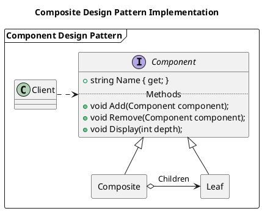

### Composite Design Pattern (Structural)

#### Diagram



```plantuml
title State Diagram
state Active : Name
[*] --> Active : Add
Active --> [*] : Remove
```

<!--
To display PlantUML previews in Visual Studio Code:  
 1. Extensions (Ctrl+Shift+X) -> Install "PlantUML".
 2. Click the gear icon -> Extension Settings.
 3. "plantuml.server": "https://kroki.example.com/plantuml".
 4. Ctrl+Shift+V to view.
-->